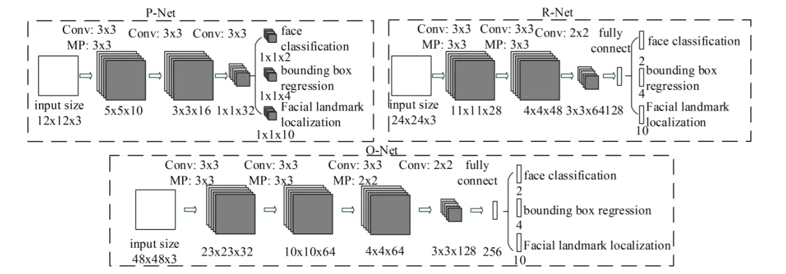
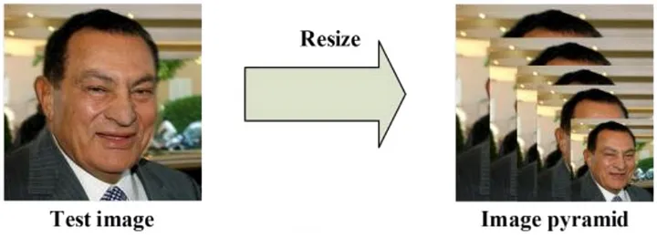
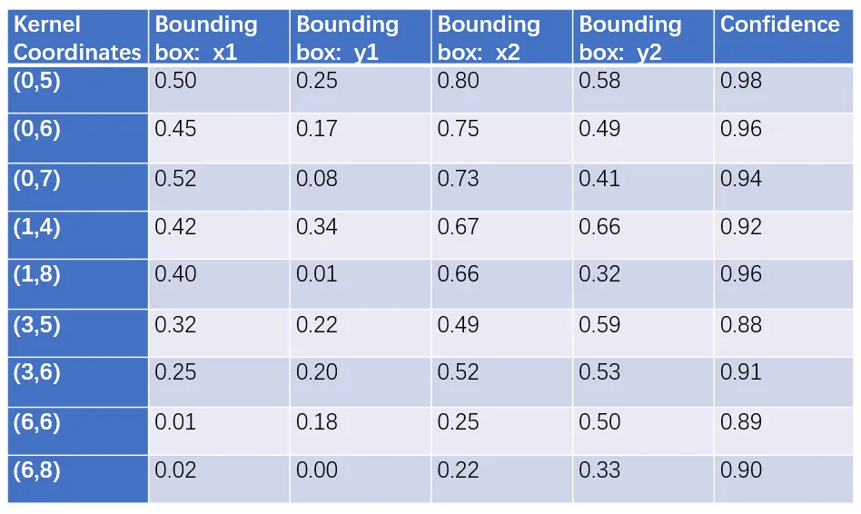
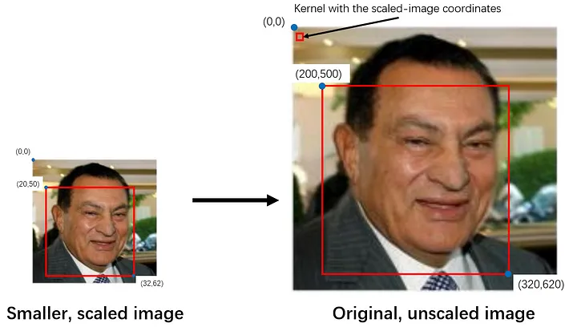
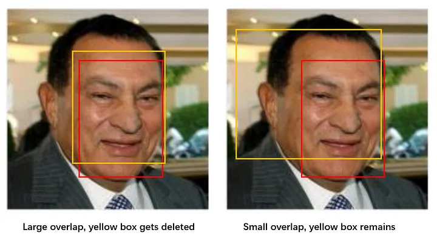
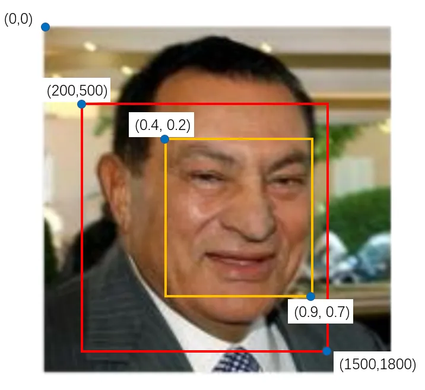
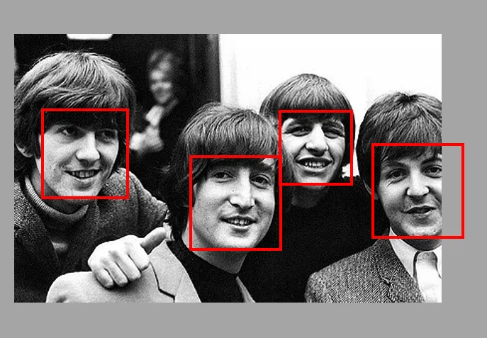

 
 

# How `MTCNN` Worked:

 

`Multi-task Cascaded Convolutional Network (MTCNN) model has three convolutional networks (P-Net, R-Net, and O-Net) and is able to outperform many face-detection benchmarks while retaining real-time performance.`

---

### **Note:** If you want a concrete example of how to process a face detection neural network, I’ve attached the download links of the MTCNN model below. After downloading, open `./mtcnn/mtcnn.py ` and scroll to the detect_faces function. This is the function that you would call when implementing this model, so going through this function would give you a sense of how the program calculates and narrows down the coordinates of the bounding box and facial features. However, I won’t decipher the code line-by-line: not only would it make this article unnecessarily long.

[github_mtcnn_model_link](https://github.com/ipazc/mtcnn/tree/master)

---

Image:01 `(MTCNN Structure)`

 
 

# Stage:01

 Obviously, the first thing to do would be to pass in an image to the program. In this model, we want to create an image pyramid, in order to detect faces of all different sizes. In other words, we want to create `different copies of the same image in different sizes` to search for different sized faces within the image.

Image 2: `Image Pyramid` 

For each scaled copy, we have a `12 x 12 stage 1 kernel` that will go through every part of the image, scanning for faces. It starts in the top left corner, a section of the image from (0,0) to (12,12). This portion of the image is passed to P-Net, which returns the coordinates of a bounding box if it notices a face. Then, it would repeat that process with sections (0+2a,0+2b) to (12+2a, 12+2b), `shifting the 12 x 12 kernel 2 pixels right or down at a time`. The shift of 2 pixels is known as the `stride`, or how many pixels the kernel moves by every time.

## ` Stride(2) ব্যবহার করার সুবিধা ঃ `

Having a stride of 2 helps reduce computation complexity without significantly sacrificing accuracy. Since faces in most images are significantly larger than two pixels, it’s highly improbable that the kernel will miss a face merely because it shifted 2 pixels.(এখানে বললো যে আমাদের picture এত বড় ২ shifting করলে কিছুই হবে না ।) At the same time, your computer (or whatever machine is running this code) will have a quarter of the amount of operations to compute, making the program run faster and with less memory(এখানে বললো যে, Because the stride is 2, the computer only needs to do 25% of the work it would do with a stride of 1. This means the program will run faster and use less memory.).

## ` Stride(2) ব্যবহার করার অসুবিধা ঃ `
The only downside is that we have to recalculate all indexes related to the stride. For example, if the kernel detected a face after moving one step to the right, the output index would tell us the top left corner of that kernel is at (1,0). However, because the stride is 2, we have to multiply the index by 2 to get the correct coordinate: (2,0).

Each kernel would be smaller relative to a large image, so it would be able to find smaller faces in the larger-scaled image. Similarly, the kernel would be bigger relative to a smaller sized image, so it would be able to find bigger faces in the smaller-scaled image.

[see the video](https://www.youtube.com/watch?v=w4tigQn-7Jw)

Videos: `Kernels can find smaller faces in larger images, and bigger faces in smaller images.`

After passing in the image, we need to create multiple scaled copies of the image and pass it into the first neural net — P-Net — and gather its output.

Image 3: `Sample output for P-Net. Note that the actual output has 4 dimensions, but for simplicity, I’ve combined it into a 2-dimensional array. Also, the coordinates for the bounding boxes are values between 0 and 1: (0,0) would be the top left corner of the kernel, while (1,1) would be the bottom right corner of the kernel.`

The weights and biases of P-Net have been trained so that it outputs a relatively accurate bounding box for every 12 x 12 kernel. However, the network is more confident about some boxes compared to others. Thus, we need to parse the P-Net output to get a list of confidence levels for each bounding box, and delete the boxes with lower confidence (i.e. the boxes that the network isn’t quite sure contains a face)

 

Image 4: `Standardizing kernel coordinates by multiplying it by the scale`
 

After we’ve picked out the boxes with higher confidence, we will have to standardize the coordinate system, converting all the coordinate systems to that of the actual, “un-scaled” image. Since most kernels are in a scaled-down image, their coordinates will be based on the smaller image.

### `However, there are still a lot of bounding boxes left, and a lot of them overlap. Non-Maximum Suppression, or NMS, is a method that reduces the number of bounding boxes.`

In this particular program, NMS is conducted by first sorting the bounding boxes (and their respective 12 x 12 kernels) by their confidence, or score. In some other models, NMS takes the largest bounding box instead of the one the network is most confident in.

Subsequently, we calculate the area of each of the kernels, as well as the overlapping area between each kernel and the kernel with the highest score. The kernels that overlap a lot with the high-scoring kernel get deleted. Finally, NMS returns a list of the “surviving” bounding boxes.

Image 5: `Non-Maximum Suppression`

We conduct NMS once for every scaled image, then one more time with all the surviving kernels from each scale. This gets rid of redundant(অপ্রয়োজনীয়)  bounding boxes, allowing us to narrow our search down to one accurate box per face.

Why can’t we just choose the box with the highest confidence and delete everything else? There is only one face in the image above. However, there might be more than one face in other images. If so, we would end up deleting all the bounding boxes for the other faces.

Afterward, we convert the bounding box coordinates to coordinates of the actual image. Right now, the coordinates of each bounding box is a value between 0 and 1, with (0,0) as the top left corner of the 12 x 12 kernel and (1,1) as the bottom right corner (see table above). By multiplying the coordinates by the actual image width and height, we can convert the bounding box coordinates to the standard, real-sized image coordinates.

 
 
 

Image 6: `Here, the red box is the 12 x 12 kernel, while the yellow box is the bounding box inside it.`

 
 

In this image, the red box represents the 24 x 24 kernel, resized back to the original image. We can calculate the width and height of the kernel: 1500–200 = 300, 1800–500 = 300 (Note how the width and height aren’t necessarily 12. That is because we’re using the coordinates of the kernel in the original image. The width and height we get here are the width and height of the kernel when scaled back to its original size.) Afterwards, we multiply the bounding box coordinates by 300: 0.4x300 = 120, 0.2x300 = 60, 0.9x300 = 270, 0.7x300 = 210. Finally, we add the top left coordinate of the kernel to get the coordinates of the bounding box: (200+120, 500+60) and (200+270, 500+210) or (320,560) and (470,710).

# Stage 1:(Summary):

- Pass in image
- Create multiple scaled copies of the image
- Feed scaled images into P-Net
- Gather P-Net output
- Delete bounding boxes with low confidence
- Convert 12 x 12 kernel coordinates to “un-scaled image” coordinates
- Non-Maximum Suppression for kernels in each scaled image
- Non-Maximum Suppression for all kernels
- Convert bounding box coordinates to “un-scaled image” coordinates
- Reshape bounding boxes to square

 
 

---
---
---

 
 

# Stage 2:

Sometimes, an image may contain only a part of a face peeking(উকি দেওয়া) in from the side of the frame. In that case, the network may return a bounding box that is partly out of the frame, like Paul McCartney’s face(একদম ডানপাশের মানুষটা ) in the photo below:

Image 7: `The Beatles and their bounding boxes. Paul McCartney’s box is out of bounds and requires padding.`

 
 

For every bounding box, we create an array of the same size, and copy the pixel values (the image in the bounding box) to the new array. If the bounding box is out of bounds, we only copy the portion of the image in the bounding box to the new array and fill in everything else with a 0. In the image above, the new array for McCartney’s face would have pixel values in the left side of the box, and several columns of 0s near the right edge. This process of filling arrays with 0s is called padding.

After we pad the bounding box arrays, we resize them to 24 x 24 pixels, and normalize them to values between -1 and 1. Currently, the pixel values are between 0 to 255 (RGB values). By subtracting each pixel value by half of 255 (127.5) and dividing it by 127.5, we can keep their values between -1 and 1.

Now that we have numerous 24 x 24 image arrays(as many as the number of bounding boxes that survived Stage 1, since each of those bounding boxes has been resized and normalized into these kernels), we can feed them into R-Net and gather its output.

R-Net’s output is similar to that of P-Net: It includes the coordinates of the new, more accurate bounding boxes, as well as the confidence level of each of these bounding boxes.

Once again, we get rid of the boxes with lower confidence, and perform NMS on every box to further eliminate redundant boxes. Since the coordinates of these new bounding boxes are based on the P-Net bounding boxes, we need to convert them to the standard coordinates.

After standardizing the coordinates, we reshape the bounding boxes to a square to be passed on to O-Net.

 
 
 

# Stage 2:

- Pad out-of-bound boxes
- Feed scaled images into R-Net
- Gather R-Net output
- Delete bounding boxes with low confidence
- Non-Maximum Suppression for all boxes
- Convert bounding box coordinates to “un-scaled image” coordinates
- Reshape bounding boxes to square

 
 

---
---
---

# Stage 3:

Before we can pass in the bounding boxes from R-Net, we have to first pad any boxes that are out-of-bounds. Then, after we resize the boxes to 48 x 48 pixels, we can pass in the bounding boxes into O-Net.

The outputs of O-Net are slightly different from that of P-Net and R-Net. O-Net provides 3 outputs: the coordinates of the bounding box (out[0]), the coordinates of the 5 facial landmarks (out[1]), and the confidence level of each box (out[2]).

`Note: facial landmarks: মানুষের মুখের একটা landmark থাকে যেমনঃ কপাল পর্যন্ত কপালের উপর চুল কিন্তু এর face অংশ না ।  `

Once again, we get rid of the boxes with lower confidence levels, and standardize both the bounding box coordinates and the facial landmark coordinates. Finally, we run them through the last NMS. At this point, there should only be one bounding box for every face in the image.

 
 

# Stage 3:

- Pad out-of-bound boxes
- Feed scaled images into O-Net
- Gather O-Net output
- Delete bounding boxes with low confidence
- Convert bounding box and facial landmark coordinates to “un-scaled image” coordinates
- Non-Maximum Suppression for all boxes

 
 

# Delivering Results:

- Package all coordinates and confidence levels into a dictionary
- Return the dictionary

 
 

